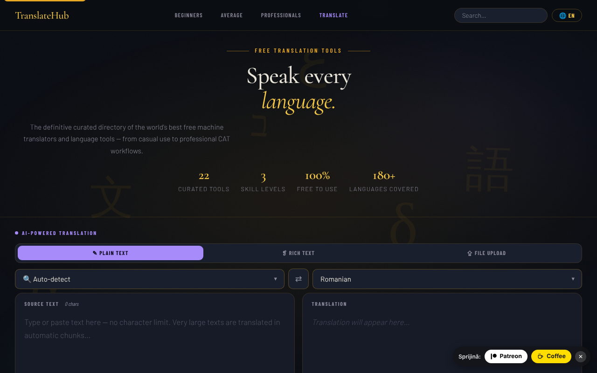

# TranslateHub

Director de instrumente gratuite de traducere, cu un traducător AI integrat (Claude), într-un singur fișier HTML.

**Live:** https://chiuta.github.io/TranslateHub/

## Ce este

TranslateHub este o pagină unică (`index.html`) care combină două lucruri:

- un director curatoriat de 22 de instrumente gratuite de traducere și lingvistică (Google Translate, DeepL, Linguee, WordReference, MateCat, OmegaT, LibreTranslate etc.), grupate pe trei niveluri: *Beginners*, *Average* și *Professionals*;
- un traducător AI care folosește API-ul Anthropic (Claude), cu cheia API furnizată de utilizator.

## Funcții

- Director cu fișe pentru fiecare instrument (descriere, caracteristici, număr aproximativ de limbi, buton „Open ↗"), cu căutare („Search translation tools") și link-uri de navigare pe niveluri.
- Trei moduri de traducere cu AI: **Plain Text**, **Rich Text** (bară de formatare B / I / U / H1–H3 / liste / tabel; export `.html`) și **File Upload**.
- Încărcare de fișiere (max. 2 MB): `.txt`, `.md`, `.html`, `.docx`, `.srt`, `.po`, `.csv`, `.json`; previzualizare și descărcarea fișierului tradus.
- Alegerea limbii sursă (cu „Auto-detect") și a limbii țintă, buton de inversare (⇄), căutare în lista de limbi.
- Contor de caractere și cuvinte, butoane „Clear", „Copy", „↓ .txt".
- Buton „Cancel" pentru o traducere în curs.
- Limba interfeței: selector „EN" în bara de sus. Traduceri încorporate pentru 20 de limbi (en, ro, fr, es, de, it, pt, ru, zh-Hans, ja, ar, ko, tr, pl, nl, sv, cs, hu, el, hi); pentru alte limbi interfața este tradusă prin API-ul Claude și păstrată în cache local.
- Secțiuni juridice/de confidențialitate în aplicație (GDPR, stocare în browser, transferuri către terți).

## Manual de utilizare

1. Deschideți pagina. Pentru traducerea cu AI, în bannerul „API key required" introduceți cheia Anthropic în câmpul „Anthropic API key" și apăsați „Save key". „Clear" o șterge; „Get key ↗" deschide pagina de obținere a cheii.
2. Alegeți modul: „✎ Plain Text", „❡ Rich Text" sau „⇪ File Upload".
3. Alegeți limba sursă (sau „Auto-detect") și limba țintă; ⇄ le inversează.
4. Scrieți/lipiți textul (sau trageți fișierul în zona „Drop your file here" / faceți clic pentru a-l alege).
5. Apăsați butonul **Translate** sau `Ctrl+Enter` (`Cmd+Enter` pe macOS) în câmpul de text.
6. Copiați rezultatul („⧉ Copy"), descărcați-l („↓ .txt", „↓ .html" sau „↓ Download translated file").
7. Pentru a schimba limba interfeței, apăsați butonul de limbă din bara de sus și alegeți limba; alegerea se reține.
8. Pentru directorul de instrumente, derulați la „Beginners", „Average users" sau „Professionals" sau folosiți căutarea; „Open ↗" deschide site-ul instrumentului într-o filă nouă.

## Confidențialitate și rețea

- **Stocare locală:** `localStorage` — codul limbii interfeței (`ui_lang_pref`, `ui_lang_name`) și traducerile de interfață păstrate în cache (`ui_<cod>`). `sessionStorage` — cheia API Anthropic (`th_apikey`), ștearsă la închiderea filei. Aplicația nu setează cookie-uri.
- **Rețea:** aplicația contactează `https://api.anthropic.com/v1/messages` **doar** când folosiți traducerea cu AI sau când alegeți o limbă de interfață fără traducere încorporată. Textul introdus (sau conținutul fișierului) și cheia dumneavoastră sunt trimise către Anthropic; politica aplicației menționează păstrarea datelor de către Anthropic până la 30 de zile. Politica de securitate a paginii (CSP) permite conexiuni doar către acest host.
- Fonturile sunt încorporate în fișier; parserul `.docx` (mammoth.js) este inclus local în `vendor/`.
- Link-urile din director către site-urile instrumentelor sunt simple legături; nu se face nicio cerere către ele până nu le deschideți.
- Fără analitice și fără reclame (conform notei din aplicație).

## Rulare locală / offline

Descărcați `index.html` (și, pentru fișiere `.docx`, folderul `vendor/`) și deschideți-l în browser. Directorul de instrumente și interfața în cele 20 de limbi încorporate funcționează fără internet; traducerea AI necesită conexiune la internet și o cheie API Anthropic.

## Licență

CC0 1.0 Universal (domeniu public) — vezi fișierul LICENSE

## Autor

Alexio — Alexandru-Ionuț Chiuță. Contact: alexio@trom.tf

## English summary

TranslateHub is a single-file HTML page with a curated directory of 22 free translation tools plus an AI translator (plain text, rich text, file upload for 8 formats) that calls the Anthropic API with the user's own key, kept in sessionStorage. The UI ships with 20 built-in languages. The only host contacted is api.anthropic.com, and only when AI features are used. CC0 1.0.
